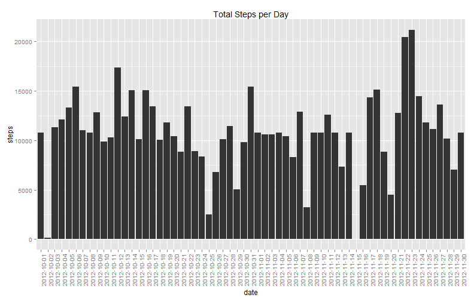

# Reproducible Research: Peer Assessment 1
This is in fulfillment of assigment 1 of the 
Reproducible Research course, May 2014

### Set global options

```r
opts_chunk$set(echo = TRUE)
```


## Loading and preprocessing the data
- 1. Load the data (i.e. read.csv())

```r
setwd("~/GitHub/RepData_PeerAssessment1")

# Read data file
data <- read.csv(unz("activity.zip", "activity.csv"), header = T, sep = ",", 
    na.strings = "NA", colClasses = c("integer", "character", "integer"))
```

- 2. Process/transform the data (if necessary) into a format suitable for your analysis

```r
# Create factor variable for date and then convert date
data$datefactor <- factor(data$date)
data$date <- strptime(data$date, format = "%Y-%m-%d")

# Print out summary of data to be analyzed
summary(data)
```

```
##      steps            date                        interval   
##  Min.   :  0.0   Min.   :2012-10-01 00:00:00   Min.   :   0  
##  1st Qu.:  0.0   1st Qu.:2012-10-16 00:00:00   1st Qu.: 589  
##  Median :  0.0   Median :2012-10-31 00:00:00   Median :1178  
##  Mean   : 37.4   Mean   :2012-10-31 00:25:34   Mean   :1178  
##  3rd Qu.: 12.0   3rd Qu.:2012-11-15 00:00:00   3rd Qu.:1766  
##  Max.   :806.0   Max.   :2012-11-30 00:00:00   Max.   :2355  
##  NA's   :2304                                                
##       datefactor   
##  2012-10-01:  288  
##  2012-10-02:  288  
##  2012-10-03:  288  
##  2012-10-04:  288  
##  2012-10-05:  288  
##  2012-10-06:  288  
##  (Other)   :15840
```


## What is mean total number of steps taken per day?
For this part of the assignment, you can ignore the missing values in the dataset.


```r
# summarize steps per day using aggregate function
dailysteps <- aggregate(steps ~ datefactor, data, sum)

# add column names
colnames(dailysteps) <- c("date", "steps")
```


- 1. Make a histogram of the total number of steps taken each day

```r
library(ggplot2)

# create plot using ggplot and add relevant features
q <- ggplot(dailysteps, aes(x = date, y = steps)) + geom_bar(stat = "identity")
q + theme(axis.text.x = element_text(angle = 90)) + ggtitle("Total Steps per Day")
```

 


- 2. Calculate and report the mean and median total number of steps taken per day

Note: Requires package xtable.  If not installed, run

`install.packages("xtable")`
<table border = 1>
<tr>
<td>
<!-- html table generated in R 3.0.3 by xtable 1.7-3 package -->
<!-- Sun May 18 03:09:39 2014 -->
<TABLE border=1>
<TR> <TH>  </TH> <TH> Date </TH> <TH> Total Steps </TH> <TH> Mean Steps </TH> <TH> Median Steps </TH>  </TR>
  <TR> <TD align="right"> 1 </TD> <TD> 2012-10-02 </TD> <TD align="right"> 126 </TD> <TD align="right"> 126 </TD> <TD align="right"> 126 </TD> </TR>
  <TR> <TD align="right"> 2 </TD> <TD> 2012-10-03 </TD> <TD align="right"> 11352 </TD> <TD align="right"> 11352 </TD> <TD align="right"> 11352 </TD> </TR>
  <TR> <TD align="right"> 3 </TD> <TD> 2012-10-04 </TD> <TD align="right"> 12116 </TD> <TD align="right"> 12116 </TD> <TD align="right"> 12116 </TD> </TR>
  <TR> <TD align="right"> 4 </TD> <TD> 2012-10-05 </TD> <TD align="right"> 13294 </TD> <TD align="right"> 13294 </TD> <TD align="right"> 13294 </TD> </TR>
  <TR> <TD align="right"> 5 </TD> <TD> 2012-10-06 </TD> <TD align="right"> 15420 </TD> <TD align="right"> 15420 </TD> <TD align="right"> 15420 </TD> </TR>
  <TR> <TD align="right"> 6 </TD> <TD> 2012-10-07 </TD> <TD align="right"> 11015 </TD> <TD align="right"> 11015 </TD> <TD align="right"> 11015 </TD> </TR>
  <TR> <TD align="right"> 7 </TD> <TD> 2012-10-09 </TD> <TD align="right"> 12811 </TD> <TD align="right"> 12811 </TD> <TD align="right"> 12811 </TD> </TR>
  <TR> <TD align="right"> 8 </TD> <TD> 2012-10-10 </TD> <TD align="right"> 9900 </TD> <TD align="right"> 9900 </TD> <TD align="right"> 9900 </TD> </TR>
  <TR> <TD align="right"> 9 </TD> <TD> 2012-10-11 </TD> <TD align="right"> 10304 </TD> <TD align="right"> 10304 </TD> <TD align="right"> 10304 </TD> </TR>
  <TR> <TD align="right"> 10 </TD> <TD> 2012-10-12 </TD> <TD align="right"> 17382 </TD> <TD align="right"> 17382 </TD> <TD align="right"> 17382 </TD> </TR>
  <TR> <TD align="right"> 11 </TD> <TD> 2012-10-13 </TD> <TD align="right"> 12426 </TD> <TD align="right"> 12426 </TD> <TD align="right"> 12426 </TD> </TR>
  <TR> <TD align="right"> 12 </TD> <TD> 2012-10-14 </TD> <TD align="right"> 15098 </TD> <TD align="right"> 15098 </TD> <TD align="right"> 15098 </TD> </TR>
  <TR> <TD align="right"> 13 </TD> <TD> 2012-10-15 </TD> <TD align="right"> 10139 </TD> <TD align="right"> 10139 </TD> <TD align="right"> 10139 </TD> </TR>
  <TR> <TD align="right"> 14 </TD> <TD> 2012-10-16 </TD> <TD align="right"> 15084 </TD> <TD align="right"> 15084 </TD> <TD align="right"> 15084 </TD> </TR>
  <TR> <TD align="right"> 15 </TD> <TD> 2012-10-17 </TD> <TD align="right"> 13452 </TD> <TD align="right"> 13452 </TD> <TD align="right"> 13452 </TD> </TR>
  <TR> <TD align="right"> 16 </TD> <TD> 2012-10-18 </TD> <TD align="right"> 10056 </TD> <TD align="right"> 10056 </TD> <TD align="right"> 10056 </TD> </TR>
  <TR> <TD align="right"> 17 </TD> <TD> 2012-10-19 </TD> <TD align="right"> 11829 </TD> <TD align="right"> 11829 </TD> <TD align="right"> 11829 </TD> </TR>
  <TR> <TD align="right"> 18 </TD> <TD> 2012-10-20 </TD> <TD align="right"> 10395 </TD> <TD align="right"> 10395 </TD> <TD align="right"> 10395 </TD> </TR>
  <TR> <TD align="right"> 19 </TD> <TD> 2012-10-21 </TD> <TD align="right"> 8821 </TD> <TD align="right"> 8821 </TD> <TD align="right"> 8821 </TD> </TR>
  <TR> <TD align="right"> 20 </TD> <TD> 2012-10-22 </TD> <TD align="right"> 13460 </TD> <TD align="right"> 13460 </TD> <TD align="right"> 13460 </TD> </TR>
  <TR> <TD align="right"> 21 </TD> <TD> 2012-10-23 </TD> <TD align="right"> 8918 </TD> <TD align="right"> 8918 </TD> <TD align="right"> 8918 </TD> </TR>
  <TR> <TD align="right"> 22 </TD> <TD> 2012-10-24 </TD> <TD align="right"> 8355 </TD> <TD align="right"> 8355 </TD> <TD align="right"> 8355 </TD> </TR>
  <TR> <TD align="right"> 23 </TD> <TD> 2012-10-25 </TD> <TD align="right"> 2492 </TD> <TD align="right"> 2492 </TD> <TD align="right"> 2492 </TD> </TR>
  <TR> <TD align="right"> 24 </TD> <TD> 2012-10-26 </TD> <TD align="right"> 6778 </TD> <TD align="right"> 6778 </TD> <TD align="right"> 6778 </TD> </TR>
  <TR> <TD align="right"> 25 </TD> <TD> 2012-10-27 </TD> <TD align="right"> 10119 </TD> <TD align="right"> 10119 </TD> <TD align="right"> 10119 </TD> </TR>
  <TR> <TD align="right"> 26 </TD> <TD> 2012-10-28 </TD> <TD align="right"> 11458 </TD> <TD align="right"> 11458 </TD> <TD align="right"> 11458 </TD> </TR>
  <TR> <TD align="right"> 27 </TD> <TD> 2012-10-29 </TD> <TD align="right"> 5018 </TD> <TD align="right"> 5018 </TD> <TD align="right"> 5018 </TD> </TR>
  <TR> <TD align="right"> 28 </TD> <TD> 2012-10-30 </TD> <TD align="right"> 9819 </TD> <TD align="right"> 9819 </TD> <TD align="right"> 9819 </TD> </TR>
  <TR> <TD align="right"> 29 </TD> <TD> 2012-10-31 </TD> <TD align="right"> 15414 </TD> <TD align="right"> 15414 </TD> <TD align="right"> 15414 </TD> </TR>
  <TR> <TD align="right"> 30 </TD> <TD> 2012-11-02 </TD> <TD align="right"> 10600 </TD> <TD align="right"> 10600 </TD> <TD align="right"> 10600 </TD> </TR>
  <TR> <TD align="right"> 31 </TD> <TD> 2012-11-03 </TD> <TD align="right"> 10571 </TD> <TD align="right"> 10571 </TD> <TD align="right"> 10571 </TD> </TR>
  <TR> <TD align="right"> 32 </TD> <TD> 2012-11-05 </TD> <TD align="right"> 10439 </TD> <TD align="right"> 10439 </TD> <TD align="right"> 10439 </TD> </TR>
  <TR> <TD align="right"> 33 </TD> <TD> 2012-11-06 </TD> <TD align="right"> 8334 </TD> <TD align="right"> 8334 </TD> <TD align="right"> 8334 </TD> </TR>
  <TR> <TD align="right"> 34 </TD> <TD> 2012-11-07 </TD> <TD align="right"> 12883 </TD> <TD align="right"> 12883 </TD> <TD align="right"> 12883 </TD> </TR>
  <TR> <TD align="right"> 35 </TD> <TD> 2012-11-08 </TD> <TD align="right"> 3219 </TD> <TD align="right"> 3219 </TD> <TD align="right"> 3219 </TD> </TR>
  <TR> <TD align="right"> 36 </TD> <TD> 2012-11-11 </TD> <TD align="right"> 12608 </TD> <TD align="right"> 12608 </TD> <TD align="right"> 12608 </TD> </TR>
  <TR> <TD align="right"> 37 </TD> <TD> 2012-11-12 </TD> <TD align="right"> 10765 </TD> <TD align="right"> 10765 </TD> <TD align="right"> 10765 </TD> </TR>
  <TR> <TD align="right"> 38 </TD> <TD> 2012-11-13 </TD> <TD align="right"> 7336 </TD> <TD align="right"> 7336 </TD> <TD align="right"> 7336 </TD> </TR>
  <TR> <TD align="right"> 39 </TD> <TD> 2012-11-15 </TD> <TD align="right"> 41 </TD> <TD align="right"> 41 </TD> <TD align="right"> 41 </TD> </TR>
  <TR> <TD align="right"> 40 </TD> <TD> 2012-11-16 </TD> <TD align="right"> 5441 </TD> <TD align="right"> 5441 </TD> <TD align="right"> 5441 </TD> </TR>
  <TR> <TD align="right"> 41 </TD> <TD> 2012-11-17 </TD> <TD align="right"> 14339 </TD> <TD align="right"> 14339 </TD> <TD align="right"> 14339 </TD> </TR>
  <TR> <TD align="right"> 42 </TD> <TD> 2012-11-18 </TD> <TD align="right"> 15110 </TD> <TD align="right"> 15110 </TD> <TD align="right"> 15110 </TD> </TR>
  <TR> <TD align="right"> 43 </TD> <TD> 2012-11-19 </TD> <TD align="right"> 8841 </TD> <TD align="right"> 8841 </TD> <TD align="right"> 8841 </TD> </TR>
  <TR> <TD align="right"> 44 </TD> <TD> 2012-11-20 </TD> <TD align="right"> 4472 </TD> <TD align="right"> 4472 </TD> <TD align="right"> 4472 </TD> </TR>
  <TR> <TD align="right"> 45 </TD> <TD> 2012-11-21 </TD> <TD align="right"> 12787 </TD> <TD align="right"> 12787 </TD> <TD align="right"> 12787 </TD> </TR>
  <TR> <TD align="right"> 46 </TD> <TD> 2012-11-22 </TD> <TD align="right"> 20427 </TD> <TD align="right"> 20427 </TD> <TD align="right"> 20427 </TD> </TR>
  <TR> <TD align="right"> 47 </TD> <TD> 2012-11-23 </TD> <TD align="right"> 21194 </TD> <TD align="right"> 21194 </TD> <TD align="right"> 21194 </TD> </TR>
  <TR> <TD align="right"> 48 </TD> <TD> 2012-11-24 </TD> <TD align="right"> 14478 </TD> <TD align="right"> 14478 </TD> <TD align="right"> 14478 </TD> </TR>
  <TR> <TD align="right"> 49 </TD> <TD> 2012-11-25 </TD> <TD align="right"> 11834 </TD> <TD align="right"> 11834 </TD> <TD align="right"> 11834 </TD> </TR>
  <TR> <TD align="right"> 50 </TD> <TD> 2012-11-26 </TD> <TD align="right"> 11162 </TD> <TD align="right"> 11162 </TD> <TD align="right"> 11162 </TD> </TR>
  <TR> <TD align="right"> 51 </TD> <TD> 2012-11-27 </TD> <TD align="right"> 13646 </TD> <TD align="right"> 13646 </TD> <TD align="right"> 13646 </TD> </TR>
  <TR> <TD align="right"> 52 </TD> <TD> 2012-11-28 </TD> <TD align="right"> 10183 </TD> <TD align="right"> 10183 </TD> <TD align="right"> 10183 </TD> </TR>
  <TR> <TD align="right"> 53 </TD> <TD> 2012-11-29 </TD> <TD align="right"> 7047 </TD> <TD align="right"> 7047 </TD> <TD align="right"> 7047 </TD> </TR>
   </TABLE>

</td>
</tr>
</table>
## What is the average daily activity pattern?
- 1. Make a time series plot (i.e. type = "l") of the 5-minute interval (x-axis) and the average number of steps taken, averaged across all days (y-axis)

```r
library(lattice)
# aggregate 5 minute intervals across all days
data$intfactor <- as.factor(data$interval)
intmean <- aggregate(data$steps, by = list(data$intfactor), FUN = "mean", na.rm = TRUE)
colnames(intmean) <- c("Interval", "Steps")

# plot 5-minute interval averages
xyplot(Steps ~ Interval, data = intmean, type = "l", main = "Average Steps per Interval", 
    xlab = "5-Minute Interval", ylab = "Average Steps Taken", scales = list(x = list(at = seq(0, 
        300, 50))))
```

 

- 2. Which 5-minute interval, on average across all the days in the dataset, contains the maximum number of steps?

```r
# find maximum 5-minute interval
maxint <- as.numeric(intmean[which.max(intmean$Steps), ]$Interval)
max5 <- intmean[maxint, ]
```

The interval with the maximum 5-minute average is 

```r
print(max5)
```

```
##     Interval Steps
## 104      835 206.2
```

## Imputing missing values
-  1. Calculate and report the total number of missing values in the dataset (i.e. the total number of rows with NAs)


```r
missing <- is.na(data$steps)
nacount <- sum(missing)
```

Number of missing values = 2304

-  2. Devise a strategy for filling in all of the missing values in the dataset. The strategy does not need to be sophisticated. For example, you could use the mean/median for that day, or the mean for that 5-minute interval, etc.

```r
# I'd like to do something more sophisticated, but I'm running out of time
# to complete this assignment
data$steps[missing] = mean(data$steps, na.rm = T)
```

-  3. Create a new dataset that is equal to the original dataset but with the missing data filled in.

This is already done, so I'll just retrieve the original data into a new data frame.

```r
origdata <- read.csv(unz("activity.zip", "activity.csv"), header = T, sep = ",", 
    na.strings = "NA", colClasses = c("integer", "character", "integer"))
origdata$date <- strptime(origdata$date, format = "%Y-%m-%d")
```


-  4. Make a histogram of the total number of steps taken each day and Calculate and report the mean and median total number of steps taken per day. Do these values differ from the estimates from the first part of the assignment? What is the impact of imputing missing data on the estimates of the total daily number of steps?

```r
# summarize steps per day using aggregate function
dailysteps2 <- aggregate(steps ~ datefactor, data, sum)

# add column names
colnames(dailysteps2) <- c("date", "steps")
```


New histogram of the total number of steps taken each day

```r
# create plot using ggplot and add relevant features
q2 <- ggplot(dailysteps2, aes(x = date, y = steps)) + geom_bar(stat = "identity")
q2 + theme(axis.text.x = element_text(angle = 90)) + ggtitle("Total Steps per Day")
```

 

<table border = 1>
<tr>
<td>
<!-- html table generated in R 3.0.3 by xtable 1.7-3 package -->
<!-- Sun May 18 03:09:40 2014 -->
<TABLE border=1>
<TR> <TH>  </TH> <TH> Date </TH> <TH> Total Steps </TH> <TH> Mean Steps </TH> <TH> Median Steps </TH>  </TR>
  <TR> <TD align="right"> 1 </TD> <TD> 2012-10-01 </TD> <TD align="right"> 10766 </TD> <TD align="right"> 10766 </TD> <TD align="right"> 10766 </TD> </TR>
  <TR> <TD align="right"> 2 </TD> <TD> 2012-10-02 </TD> <TD align="right"> 126 </TD> <TD align="right"> 126 </TD> <TD align="right"> 126 </TD> </TR>
  <TR> <TD align="right"> 3 </TD> <TD> 2012-10-03 </TD> <TD align="right"> 11352 </TD> <TD align="right"> 11352 </TD> <TD align="right"> 11352 </TD> </TR>
  <TR> <TD align="right"> 4 </TD> <TD> 2012-10-04 </TD> <TD align="right"> 12116 </TD> <TD align="right"> 12116 </TD> <TD align="right"> 12116 </TD> </TR>
  <TR> <TD align="right"> 5 </TD> <TD> 2012-10-05 </TD> <TD align="right"> 13294 </TD> <TD align="right"> 13294 </TD> <TD align="right"> 13294 </TD> </TR>
  <TR> <TD align="right"> 6 </TD> <TD> 2012-10-06 </TD> <TD align="right"> 15420 </TD> <TD align="right"> 15420 </TD> <TD align="right"> 15420 </TD> </TR>
  <TR> <TD align="right"> 7 </TD> <TD> 2012-10-07 </TD> <TD align="right"> 11015 </TD> <TD align="right"> 11015 </TD> <TD align="right"> 11015 </TD> </TR>
  <TR> <TD align="right"> 8 </TD> <TD> 2012-10-08 </TD> <TD align="right"> 10766 </TD> <TD align="right"> 10766 </TD> <TD align="right"> 10766 </TD> </TR>
  <TR> <TD align="right"> 9 </TD> <TD> 2012-10-09 </TD> <TD align="right"> 12811 </TD> <TD align="right"> 12811 </TD> <TD align="right"> 12811 </TD> </TR>
  <TR> <TD align="right"> 10 </TD> <TD> 2012-10-10 </TD> <TD align="right"> 9900 </TD> <TD align="right"> 9900 </TD> <TD align="right"> 9900 </TD> </TR>
  <TR> <TD align="right"> 11 </TD> <TD> 2012-10-11 </TD> <TD align="right"> 10304 </TD> <TD align="right"> 10304 </TD> <TD align="right"> 10304 </TD> </TR>
  <TR> <TD align="right"> 12 </TD> <TD> 2012-10-12 </TD> <TD align="right"> 17382 </TD> <TD align="right"> 17382 </TD> <TD align="right"> 17382 </TD> </TR>
  <TR> <TD align="right"> 13 </TD> <TD> 2012-10-13 </TD> <TD align="right"> 12426 </TD> <TD align="right"> 12426 </TD> <TD align="right"> 12426 </TD> </TR>
  <TR> <TD align="right"> 14 </TD> <TD> 2012-10-14 </TD> <TD align="right"> 15098 </TD> <TD align="right"> 15098 </TD> <TD align="right"> 15098 </TD> </TR>
  <TR> <TD align="right"> 15 </TD> <TD> 2012-10-15 </TD> <TD align="right"> 10139 </TD> <TD align="right"> 10139 </TD> <TD align="right"> 10139 </TD> </TR>
  <TR> <TD align="right"> 16 </TD> <TD> 2012-10-16 </TD> <TD align="right"> 15084 </TD> <TD align="right"> 15084 </TD> <TD align="right"> 15084 </TD> </TR>
  <TR> <TD align="right"> 17 </TD> <TD> 2012-10-17 </TD> <TD align="right"> 13452 </TD> <TD align="right"> 13452 </TD> <TD align="right"> 13452 </TD> </TR>
  <TR> <TD align="right"> 18 </TD> <TD> 2012-10-18 </TD> <TD align="right"> 10056 </TD> <TD align="right"> 10056 </TD> <TD align="right"> 10056 </TD> </TR>
  <TR> <TD align="right"> 19 </TD> <TD> 2012-10-19 </TD> <TD align="right"> 11829 </TD> <TD align="right"> 11829 </TD> <TD align="right"> 11829 </TD> </TR>
  <TR> <TD align="right"> 20 </TD> <TD> 2012-10-20 </TD> <TD align="right"> 10395 </TD> <TD align="right"> 10395 </TD> <TD align="right"> 10395 </TD> </TR>
  <TR> <TD align="right"> 21 </TD> <TD> 2012-10-21 </TD> <TD align="right"> 8821 </TD> <TD align="right"> 8821 </TD> <TD align="right"> 8821 </TD> </TR>
  <TR> <TD align="right"> 22 </TD> <TD> 2012-10-22 </TD> <TD align="right"> 13460 </TD> <TD align="right"> 13460 </TD> <TD align="right"> 13460 </TD> </TR>
  <TR> <TD align="right"> 23 </TD> <TD> 2012-10-23 </TD> <TD align="right"> 8918 </TD> <TD align="right"> 8918 </TD> <TD align="right"> 8918 </TD> </TR>
  <TR> <TD align="right"> 24 </TD> <TD> 2012-10-24 </TD> <TD align="right"> 8355 </TD> <TD align="right"> 8355 </TD> <TD align="right"> 8355 </TD> </TR>
  <TR> <TD align="right"> 25 </TD> <TD> 2012-10-25 </TD> <TD align="right"> 2492 </TD> <TD align="right"> 2492 </TD> <TD align="right"> 2492 </TD> </TR>
  <TR> <TD align="right"> 26 </TD> <TD> 2012-10-26 </TD> <TD align="right"> 6778 </TD> <TD align="right"> 6778 </TD> <TD align="right"> 6778 </TD> </TR>
  <TR> <TD align="right"> 27 </TD> <TD> 2012-10-27 </TD> <TD align="right"> 10119 </TD> <TD align="right"> 10119 </TD> <TD align="right"> 10119 </TD> </TR>
  <TR> <TD align="right"> 28 </TD> <TD> 2012-10-28 </TD> <TD align="right"> 11458 </TD> <TD align="right"> 11458 </TD> <TD align="right"> 11458 </TD> </TR>
  <TR> <TD align="right"> 29 </TD> <TD> 2012-10-29 </TD> <TD align="right"> 5018 </TD> <TD align="right"> 5018 </TD> <TD align="right"> 5018 </TD> </TR>
  <TR> <TD align="right"> 30 </TD> <TD> 2012-10-30 </TD> <TD align="right"> 9819 </TD> <TD align="right"> 9819 </TD> <TD align="right"> 9819 </TD> </TR>
  <TR> <TD align="right"> 31 </TD> <TD> 2012-10-31 </TD> <TD align="right"> 15414 </TD> <TD align="right"> 15414 </TD> <TD align="right"> 15414 </TD> </TR>
  <TR> <TD align="right"> 32 </TD> <TD> 2012-11-01 </TD> <TD align="right"> 10766 </TD> <TD align="right"> 10766 </TD> <TD align="right"> 10766 </TD> </TR>
  <TR> <TD align="right"> 33 </TD> <TD> 2012-11-02 </TD> <TD align="right"> 10600 </TD> <TD align="right"> 10600 </TD> <TD align="right"> 10600 </TD> </TR>
  <TR> <TD align="right"> 34 </TD> <TD> 2012-11-03 </TD> <TD align="right"> 10571 </TD> <TD align="right"> 10571 </TD> <TD align="right"> 10571 </TD> </TR>
  <TR> <TD align="right"> 35 </TD> <TD> 2012-11-04 </TD> <TD align="right"> 10766 </TD> <TD align="right"> 10766 </TD> <TD align="right"> 10766 </TD> </TR>
  <TR> <TD align="right"> 36 </TD> <TD> 2012-11-05 </TD> <TD align="right"> 10439 </TD> <TD align="right"> 10439 </TD> <TD align="right"> 10439 </TD> </TR>
  <TR> <TD align="right"> 37 </TD> <TD> 2012-11-06 </TD> <TD align="right"> 8334 </TD> <TD align="right"> 8334 </TD> <TD align="right"> 8334 </TD> </TR>
  <TR> <TD align="right"> 38 </TD> <TD> 2012-11-07 </TD> <TD align="right"> 12883 </TD> <TD align="right"> 12883 </TD> <TD align="right"> 12883 </TD> </TR>
  <TR> <TD align="right"> 39 </TD> <TD> 2012-11-08 </TD> <TD align="right"> 3219 </TD> <TD align="right"> 3219 </TD> <TD align="right"> 3219 </TD> </TR>
  <TR> <TD align="right"> 40 </TD> <TD> 2012-11-09 </TD> <TD align="right"> 10766 </TD> <TD align="right"> 10766 </TD> <TD align="right"> 10766 </TD> </TR>
  <TR> <TD align="right"> 41 </TD> <TD> 2012-11-10 </TD> <TD align="right"> 10766 </TD> <TD align="right"> 10766 </TD> <TD align="right"> 10766 </TD> </TR>
  <TR> <TD align="right"> 42 </TD> <TD> 2012-11-11 </TD> <TD align="right"> 12608 </TD> <TD align="right"> 12608 </TD> <TD align="right"> 12608 </TD> </TR>
  <TR> <TD align="right"> 43 </TD> <TD> 2012-11-12 </TD> <TD align="right"> 10765 </TD> <TD align="right"> 10765 </TD> <TD align="right"> 10765 </TD> </TR>
  <TR> <TD align="right"> 44 </TD> <TD> 2012-11-13 </TD> <TD align="right"> 7336 </TD> <TD align="right"> 7336 </TD> <TD align="right"> 7336 </TD> </TR>
  <TR> <TD align="right"> 45 </TD> <TD> 2012-11-14 </TD> <TD align="right"> 10766 </TD> <TD align="right"> 10766 </TD> <TD align="right"> 10766 </TD> </TR>
  <TR> <TD align="right"> 46 </TD> <TD> 2012-11-15 </TD> <TD align="right"> 41 </TD> <TD align="right"> 41 </TD> <TD align="right"> 41 </TD> </TR>
  <TR> <TD align="right"> 47 </TD> <TD> 2012-11-16 </TD> <TD align="right"> 5441 </TD> <TD align="right"> 5441 </TD> <TD align="right"> 5441 </TD> </TR>
  <TR> <TD align="right"> 48 </TD> <TD> 2012-11-17 </TD> <TD align="right"> 14339 </TD> <TD align="right"> 14339 </TD> <TD align="right"> 14339 </TD> </TR>
  <TR> <TD align="right"> 49 </TD> <TD> 2012-11-18 </TD> <TD align="right"> 15110 </TD> <TD align="right"> 15110 </TD> <TD align="right"> 15110 </TD> </TR>
  <TR> <TD align="right"> 50 </TD> <TD> 2012-11-19 </TD> <TD align="right"> 8841 </TD> <TD align="right"> 8841 </TD> <TD align="right"> 8841 </TD> </TR>
  <TR> <TD align="right"> 51 </TD> <TD> 2012-11-20 </TD> <TD align="right"> 4472 </TD> <TD align="right"> 4472 </TD> <TD align="right"> 4472 </TD> </TR>
  <TR> <TD align="right"> 52 </TD> <TD> 2012-11-21 </TD> <TD align="right"> 12787 </TD> <TD align="right"> 12787 </TD> <TD align="right"> 12787 </TD> </TR>
  <TR> <TD align="right"> 53 </TD> <TD> 2012-11-22 </TD> <TD align="right"> 20427 </TD> <TD align="right"> 20427 </TD> <TD align="right"> 20427 </TD> </TR>
  <TR> <TD align="right"> 54 </TD> <TD> 2012-11-23 </TD> <TD align="right"> 21194 </TD> <TD align="right"> 21194 </TD> <TD align="right"> 21194 </TD> </TR>
  <TR> <TD align="right"> 55 </TD> <TD> 2012-11-24 </TD> <TD align="right"> 14478 </TD> <TD align="right"> 14478 </TD> <TD align="right"> 14478 </TD> </TR>
  <TR> <TD align="right"> 56 </TD> <TD> 2012-11-25 </TD> <TD align="right"> 11834 </TD> <TD align="right"> 11834 </TD> <TD align="right"> 11834 </TD> </TR>
  <TR> <TD align="right"> 57 </TD> <TD> 2012-11-26 </TD> <TD align="right"> 11162 </TD> <TD align="right"> 11162 </TD> <TD align="right"> 11162 </TD> </TR>
  <TR> <TD align="right"> 58 </TD> <TD> 2012-11-27 </TD> <TD align="right"> 13646 </TD> <TD align="right"> 13646 </TD> <TD align="right"> 13646 </TD> </TR>
  <TR> <TD align="right"> 59 </TD> <TD> 2012-11-28 </TD> <TD align="right"> 10183 </TD> <TD align="right"> 10183 </TD> <TD align="right"> 10183 </TD> </TR>
  <TR> <TD align="right"> 60 </TD> <TD> 2012-11-29 </TD> <TD align="right"> 7047 </TD> <TD align="right"> 7047 </TD> <TD align="right"> 7047 </TD> </TR>
  <TR> <TD align="right"> 61 </TD> <TD> 2012-11-30 </TD> <TD align="right"> 10766 </TD> <TD align="right"> 10766 </TD> <TD align="right"> 10766 </TD> </TR>
   </TABLE>

</td>
</tr>
</table>

The result of my crude impute method is that days with no readings have a total activity level of 10,766 steps, which is the average of all intervals across all days.  Also, the activity is constant.

This illustrates the danger of filling in missing data without context;)

## Are there differences in activity patterns between weekdays and weekends?

```r
data$day <- as.factor(weekdays(origdata$date))
weekend <- subset(origdata, data$day %in% c("Saturday", "Sunday"))
weekday <- subset(origdata, data$day %in% c("Monday", "Tuesday", "Wednesday", 
    "Thursday", "Friday"))

weekend$intfactor <- as.factor(weekend$interval)
weekendmean <- aggregate(weekend$steps, by = list(weekend$intfactor), FUN = "mean", 
    na.rm = TRUE)
weekendmean$day <- "weekend"
colnames(weekendmean) <- c("interval", "steps", "day")

weekday$intfactor <- as.factor(weekday$interval)
weekdaymean <- aggregate(weekday$steps, by = list(weekday$intfactor), FUN = "mean", 
    na.rm = TRUE)
weekdaymean$day <- "weekday"
colnames(weekdaymean) <- c("interval", "steps", "day")

weekdata <- rbind(weekendmean, weekdaymean)
weekdata$day <- as.factor(weekdata$day)
```

Plot weekends and weekdays

```r
xyplot(steps ~ interval | day, data = weekdata, type = "l", layout = c(1, 2), 
    main = "Average Steps per Interval", xlab = "5-Minute Interval", ylab = "Average Steps Taken", 
    scales = list(x = list(at = seq(0, 300, 50))))
```

 

